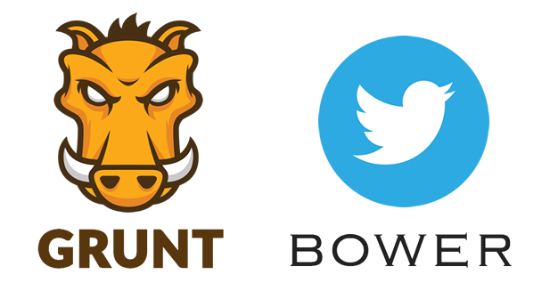
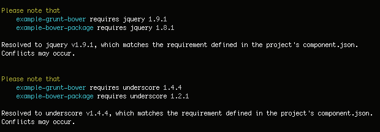

# Example project for testing bower with grunt.



## Bower Package Configuration

The `component.json` defines several options:

* `name` (required): The name of your package.
* `version`: Version number. Must be semantic (see [semver](http://semver.org/)) and an valid git tag.
* `main` [string|array]: The primary endpoints of your package (file or folder).

```
{
  "main" : "foo/"
}
```

```
{
  "main" : "bar.js"
}
```

```
{
  "main" : ["foo.js", "bar.js"]
}
```

* `ignore` [array]: An array of paths not needed in production that you want
  Bower to ignore when installing your package.

* `dependencies` [hash]: Packages your package depends upon in production.

* `devDependencies` [hash]: Development dependencies.

## Example Project Setup

```component.json``` of this project

```
{
  "name": "example-grunt-bower",
  "version": "0.1.0",
  "dependencies": {
    "jquery": "#1.9.1",
    "underscore": "#1.4.4",
    "example-bower-package": "https://github.com/netzzwerg/example-bower-package.git"
  }
}
```


```component.json``` of example-bower-package

```
{
  "name": "example-bower-package",
  "version": "0.2.1",
  "dependencies": {
    "jquery": "#1.8.1",
    "underscore": "#1.2.1"
  },
  "main" : "foo/"
}
```

Twitter Bower has no system wide dependencies,no dependencies are shared between different apps, and the dependency tree is flat. So we have here jquery and underscore twice as dependency with different versions.
Bower takes in this situation the hightest version for both.



